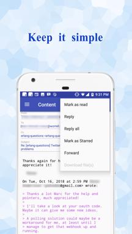

## Welcome to OMail & OMail Pro Homepage

OMail & OMail Pro are IMAP/SMTP email client on Android which have the following features:

- Multiple account support
- Automatic mailing list management
- Sort message into multiple views(account, attachment, mailing list etc)
- Batch operation on emails within the same logical group

You could watch the initial release video at :

<iframe width="560" height="315" src="https://www.youtube.com/embed/zWoh1Dqq6-Y" frameborder="0" allowfullscreen></iframe>

     

**The OMail has Ads in it and can at most add two accounts while the OMail Pro does not have ads and also has no limit for the number of email accounts to add.**

**OMail's ads only appear sometime when the app go from background to foreground. When you start the app or when you enter the app, there is no ads anymore(This is for version 1.0.3 and above).**

You can download them from the Google Play Store

 

### FAQ

1. Why can't I add email account?

        Make sure you have wifi or mobile network connection. 
        Make sure you enable IMAP/SMTP on the email server side and use correct smtp/imap
        address and port. It may also take some time for the change to take effect after
        you change the setting. So if you enable the SMTP/IMAP, but still can not add account,
        so wait for a while and try again may work.

        If you use account like Gmail, AOL mail, Yahoo Mail, you either need to turn on 'allow less
        secure app' in the account setting as following:
        https://support.google.com/accounts/answer/6010255?hl=en

        Or you need to enable 2 step verification and then create an app password to use as the
        password for your mail application. And select custom as the app type. It will then
        generate a 16 characters password which you can use as the password field for your account.

        For details, you can find in the following link.
        https://support.google.com/accounts/answer/185833?hl=en
        
2. Why does it warn me about too large email account?

        Means that your email account contains more than million of messages. Some email
        provider offer some kind of setting to limit the returned message for IMAP either by
        number of by a certain number of recent days(for example, gmail allow return 1000, 2000,
        5000, 10000 and qq.mail allow to set return the recent 30 days). Use this properly can
        reduce the time to do all operation on the mail account dramatically and also reduce
        resource usage.
        
        For example, you can set this for Gmail following the instruction below:
        https://www.lifewire.com/how-to-make-gmail-imap-faster-with-less-email-traffic-1171942

        If you email account generated more than 10 thousands of email per day, use this app at
        your own risk, it may take very long time to do all operations in this case.
        
 3. Why does the sync failed to sync some message?
 
        Since OMail is an android application, to reduce the resource usage(memory, disk etc),
        when syncing, it does not do a full sync like other email client on the desktop, instead
        it will try to sync from last syncing point. So it means it you do some change to a email
        some days ago(like mark one old message as flagged), it maybe will not be synced back
        by the normal sync.
        
        But OMail offer the possibility to do a customer sync by choosing two days, and it will
        sync all message between that two days to your phone.

4. Why does some email display different in browser and OMail?

        To avoid use too much storage of emails on the device, OMail will try to store
        plain text version of the email, unless it can judge that the email is a html mail.
        But for some email, it contains both plain text version and html version but do not
        set the plain text version correctly.That's why you may notice some difference for
        some email when you view them in OMail and your browser. But since most of these mails
        are promotion related emails, so OMail do not put much effect to resolve this problem.

